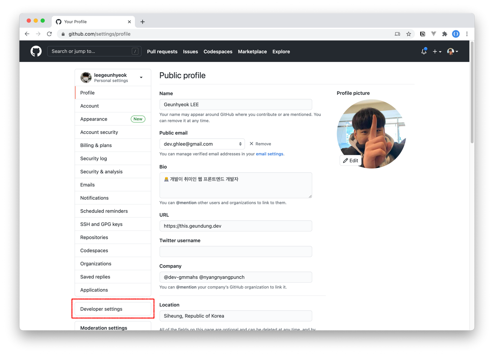

# Firebase & GitHub OAuth example

GitHub OAuth for Web

> No Server, No Payment

## Preview


## 1. Create New GitHub OAuth application

Go to `Settings > Developer settings`




Fill the blanks.

- Fill any address to callback URL field (TODO: update to Firebase oauth callback URL)


## 2. Copy GitHub application tokens

- `Client ID`, `Client secrets (Generate new secret)`


## 3. Create Firebase project

- [Firebase Console](https://console.firebase.google.com)
- Require: Google Account


## 4. Configuration Firebase project

Go to `Project settings`


and create new web app


finally, copy `firebase config values`.


## 5. Configuration Firebase authentication

Go to `Authentication` menu


Find GitHub method and fill the blanks

- GitHub `Client ID` and `secret`

and copy `accept callback URL`


## 6. Update GitHub application

Replace to Firebase callback URL


## 7. Core code example

```bash
npm install --save firebase
```

- Check `src/index.js`

```js
import firebase from 'firebase/app';
import 'firebase/auth';
// Add this line if you enabled Google Analytics.
// import 'firebase/analytics';

// ...

// Your config
const firebaseConfig = {
  apiKey: '',
  authDomain: '',
  projectId: '',
  storageBucket: '',
  messagingSenderId: '',
  appId: '',
  measurementId: '',
};

// Firebase initialization
firebase.initializeApp(firebaseConfig);
// Add this line if you enabled Google Analytics.
// firebase.analytics();
```

```js
const provider = new firebase.auth.GithubAuthProvider();
provider.addScope('repo');

firebase
  .auth()
  .signInWithPopup(provider)
  .then(({ credential }) => {
    credential.accessToken; // GitHub access token
  })
  .catch((e) => {
    // Error
  });
```
